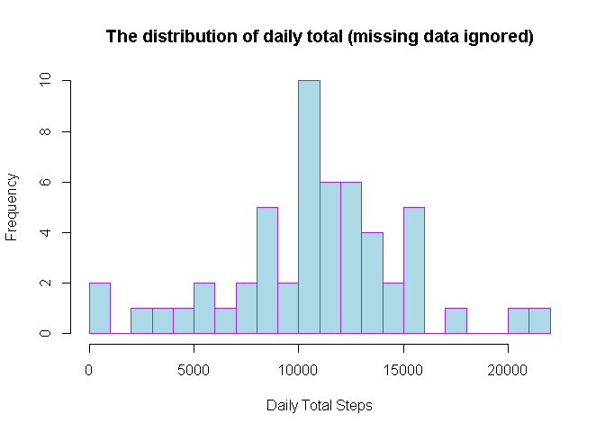
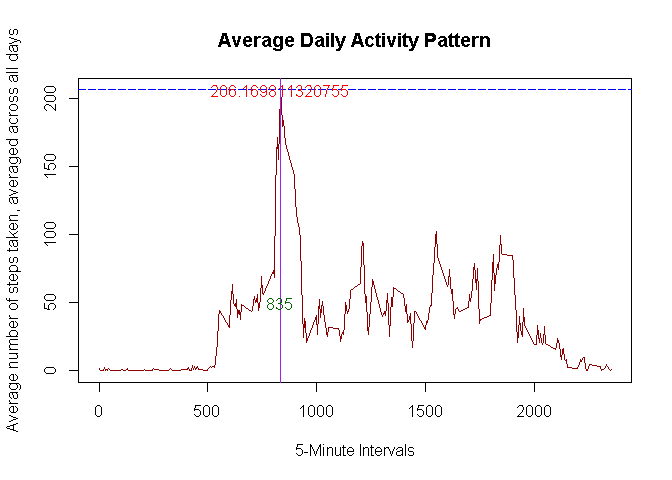
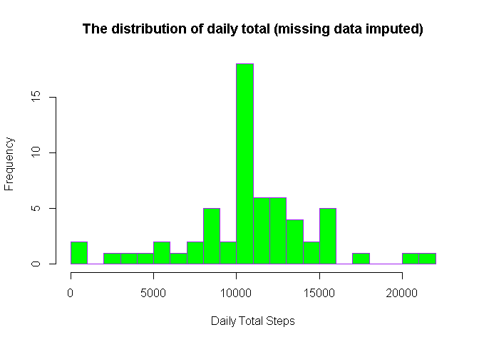
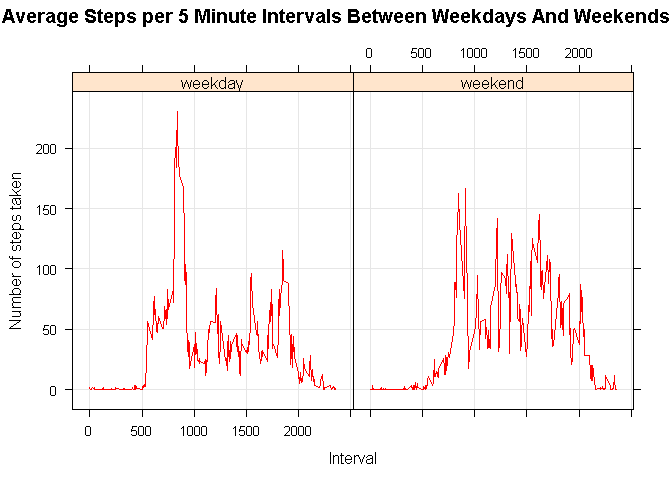

Loading and preprocessing the data
----------------------------------

The activity.zip file was automatically downloaded when I forked and
cloned the directory on my computer. First of all I will have to make
sure to set working directory so that activity.zip file is present and
can be accessed.
setwd("C:/Users/rajkum2/Desktop/Coursera/Reproducible\_Research/RepData\_PeerAssessment1").
Create data set to read the activity.zip file.

    # Set working Directory
    setwd("C:/Users/rajkum2/Desktop/Coursera/Reproducible_Research/RepData_PeerAssessment1")

    Actdata <- read.csv("activity.csv", colClasses=c("integer","Date","integer"), na.strings = "NA")
    # Explore the data.
    str(Actdata)

    ## 'data.frame':    17568 obs. of  3 variables:
    ##  $ steps   : int  NA NA NA NA NA NA NA NA NA NA ...
    ##  $ date    : Date, format: "2012-10-01" "2012-10-01" ...
    ##  $ interval: int  0 5 10 15 20 25 30 35 40 45 ...

    head(Actdata)

    ##   steps       date interval
    ## 1    NA 2012-10-01        0
    ## 2    NA 2012-10-01        5
    ## 3    NA 2012-10-01       10
    ## 4    NA 2012-10-01       15
    ## 5    NA 2012-10-01       20
    ## 6    NA 2012-10-01       25

    summary(Actdata)

    ##      steps             date               interval     
    ##  Min.   :  0.00   Min.   :2012-10-01   Min.   :   0.0  
    ##  1st Qu.:  0.00   1st Qu.:2012-10-16   1st Qu.: 588.8  
    ##  Median :  0.00   Median :2012-10-31   Median :1177.5  
    ##  Mean   : 37.38   Mean   :2012-10-31   Mean   :1177.5  
    ##  3rd Qu.: 12.00   3rd Qu.:2012-11-15   3rd Qu.:1766.2  
    ##  Max.   :806.00   Max.   :2012-11-30   Max.   :2355.0  
    ##  NA's   :2304

     # Convert Date into Year, month and day format using lubirdate package.Install package Lubridate if not avaiable.
    library(lubridate)

    ## Warning: package 'lubridate' was built under R version 3.2.2

    Actdata$date <- ymd(Actdata$date)

The variables included in this dataset are:

    steps: Number of steps taking in a 5-minute interval (missing values are coded as NA)

    date: The date on which the measurement was taken in YYYY-MM-DD format

    interval: Identifier for the 5-minute interval in which measurement was taken

The dataset is stored in a comma-separated-value (CSV) file and there
are a total of 17,568 observations in this dataset.

Initially we are supposed to ignore NA values in step so let's create a
new data set for first set of analyses and explore data afterward.

    ActdataNew <- subset(Actdata, !is.na(Actdata$steps))
    str(ActdataNew)

    ## 'data.frame':    15264 obs. of  3 variables:
    ##  $ steps   : int  0 0 0 0 0 0 0 0 0 0 ...
    ##  $ date    : POSIXct, format: "2012-10-02" "2012-10-02" ...
    ##  $ interval: int  0 5 10 15 20 25 30 35 40 45 ...

    summary(ActdataNew)

    ##      steps             date                        interval     
    ##  Min.   :  0.00   Min.   :2012-10-02 00:00:00   Min.   :   0.0  
    ##  1st Qu.:  0.00   1st Qu.:2012-10-16 00:00:00   1st Qu.: 588.8  
    ##  Median :  0.00   Median :2012-10-29 00:00:00   Median :1177.5  
    ##  Mean   : 37.38   Mean   :2012-10-30 17:12:27   Mean   :1177.5  
    ##  3rd Qu.: 12.00   3rd Qu.:2012-11-16 00:00:00   3rd Qu.:1766.2  
    ##  Max.   :806.00   Max.   :2012-11-29 00:00:00   Max.   :2355.0

The new dataset ( with NA vlaues ignored) has 15264 ovservations.

What is mean total number of steps taken per day?
-------------------------------------------------

For this part of the assignment, we will ignore the missing values in
the dataset, so we will use the new ActdataNew data set.

First calculate the total number of steps taken per day by using tapply
function and the new dataset with missing steps values ignored.
Afterward we have used hist function to create Histogram of the
distribution of daily total with missing data ignored.

    ActdataNew <- subset(Actdata, !is.na(Actdata$steps))

    ActDatabyDay <- tapply(ActdataNew$steps, ActdataNew$date, sum, na.rm=TRUE, simplify=T)
    ActDatabyDay <- ActDatabyDay[!is.na(ActDatabyDay)]

    hist(x=ActDatabyDay,
         col="lightblue", border = "purple",
         breaks=25,
         xlab="Daily Total Steps",
         ylab="Frequency",
         main="The distribution of daily total (missing data ignored)")

  
Next calculate and report the mean and median of the total number of
steps taken per day (missing data ignored).

    mean(ActDatabyDay)

    ## [1] 10766.19

    median(ActDatabyDay)

    ## [1] 10765

So the mean is 10766.19 steps and the median is 10765 steps.

What is the average daily activity pattern?
-------------------------------------------

To exam the average daily activity pattern, we created a time series
plot (i.e. type = "l") of the 5-minute interval (x-axis) and the average
number of steps taken, averaged across all days (y-axis). we will use
tapply function to each cell of ActDataNew(data with NA value removed)
for each day. we will use with function, with is a generic function that
evaluates expr in a local environment constructed from data.

    Avg_ActDaily <- tapply(ActdataNew$steps, ActdataNew$interval, mean, na.rm=TRUE, simplify=TRUE)
    AvgAct <- data.frame(interval=as.integer(names(Avg_ActDaily)), avg=Avg_ActDaily)

    with(AvgAct,
         plot(interval,
              avg,
              type="l",col= "dark red", 
              main = "Average Daily Activity Pattern", 
              xlab="5-Minute Intervals",
              ylab="Average number of steps taken, averaged across all days"))
    # Add horizontal line
    max_Activitysteps <- max(AvgAct$avg)
    steps_by_interval <- aggregate(steps ~ interval, ActdataNew, mean)
    max_interval <- steps_by_interval[which.max(steps_by_interval$steps),1]
     abline(h = max(AvgAct$avg),  col= "blue", lty = "longdash"  )
    text( max_interval, max_Activitysteps,  max_Activitysteps, col = "red")

     # Add Vertical line
     
    abline(v= max_interval , col = "purple" )
    text(max_interval, 50, max_interval, col = "darkgreen")

  

Now we will calculate Which 5-minute interval, on average across all the
days in the dataset, contains the maximum number of steps?

    max_Activitysteps <- max(AvgAct$avg)
    AvgAct[AvgAct$avg == max_Activitysteps, ]

    ##     interval      avg
    ## 835      835 206.1698

The interval 835 has, on average, the highest count of steps, with 206
steps.

Imputing missing values
-----------------------

Note that there are a number of days/intervals where there are missing
values (coded as NA). The presence of missing days may introduce bias
into some calculations or summaries of the data.

    Calculate and report the total number of missing values in the dataset (i.e. the total number of rows with NAs)

    sum(is.na(Actdata$steps))

    ## [1] 2304

So we can see that missing values of Steps are 2304.

Now we will replace these missing values of Steps via average number of
steps per 5-minute interval. We will use tapply function and also test
to make sure that there is no missing value (NA) of steps for any
interval.

    # let's find records with missing steps and create a new dataset with missing value filled in.
    impute_Actdata <- Actdata
    ActdataNas <- is.na(impute_Actdata$steps)
    mean_interval <- tapply(impute_Actdata$steps, impute_Actdata$interval, mean, na.rm=TRUE, simplify=TRUE)
    impute_Actdata$steps[ActdataNas] <- mean_interval[as.character(impute_Actdata$interval[ActdataNas])]
    # Number of records missing in newly imputed dataset
    sum(is.na(impute_Actdata$steps))

    ## [1] 0

    str(impute_Actdata)

    ## 'data.frame':    17568 obs. of  3 variables:
    ##  $ steps   : num  1.717 0.3396 0.1321 0.1509 0.0755 ...
    ##  $ date    : POSIXct, format: "2012-10-01" "2012-10-01" ...
    ##  $ interval: int  0 5 10 15 20 25 30 35 40 45 ...

so we have created a new dataset that is equal to the original dataset
but with the missing data filled in.

Now we will make a histogram of the total number of steps taken each day
and Calculate and report the mean and median total number of steps taken
per day.

    impute_ActDatabyDay <- tapply(impute_Actdata$steps, impute_Actdata$date, sum, na.rm=TRUE, simplify=T)

    hist(x=impute_ActDatabyDay,
         col="green", border = "purple",
         breaks=25,
         xlab="Daily Total Steps",
         ylab="Frequency",
         main="The distribution of daily total (missing data imputed)")

  
Now let's calculate mean and median of this new data with missing value
of steps imputed and compare it with mean and median of original dataset
with missing value.

    mean(impute_ActDatabyDay)

    ## [1] 10766.19

    mean(ActDatabyDay)

    ## [1] 10766.19

    median(impute_ActDatabyDay)

    ## [1] 10766.19

    median(ActDatabyDay)

    ## [1] 10765

Do these values differ from the estimates from the first part of the
assignment? What is the impact of imputing missing data on the estimates
of the total daily number of steps?

Based on the imputed data set, the new mean is 10766.19 which is same as
old mean of the original dataset. And the new median is 10766.19, which
is slightly more than the median of original dataset, which is 10765.
Comparing mean and median of both dataset we discover that mean and
median are same in imputed dataset. One possible explanation is that
when we fill the missing step data for the intervals by the means for
the interval, so we have more data close or identical to the means, and
median is shifted and becomes identical to the mean.

The impact of imputing missing data on the estimates of the total daily
number of steps is also clear: now we have higher frquency counts in the
histogram at the center region (close to the mean).

Are there differences in activity patterns between weekdays and weekends?
-------------------------------------------------------------------------

    Create a new factor variable in the dataset with two levels -- "weekday" and "weekend" indicating whether a given date is a weekday or weekend day.

    Here we will use dplyr package and mutate function to determine whether a day is a weekday or weekend and add Weektype column to the imputed dataset.

    # make sure dplyr package is installed, install.packages("dplyr")
    library(dplyr)

    ## Warning: package 'dplyr' was built under R version 3.2.3

    ## 
    ## Attaching package: 'dplyr'

    ## The following objects are masked from 'package:lubridate':
    ## 
    ##     intersect, setdiff, union

    ## The following objects are masked from 'package:stats':
    ## 
    ##     filter, lag

    ## The following objects are masked from 'package:base':
    ## 
    ##     intersect, setdiff, setequal, union

    impute_Actdata <- mutate(impute_Actdata, weektype = ifelse(weekdays(impute_Actdata$date) == "Saturday" | weekdays(impute_Actdata$date) == "Sunday", "weekend", "weekday"))
    impute_Actdata$weektype <- as.factor(impute_Actdata$weektype)
    head(impute_Actdata)

    ##       steps       date interval weektype
    ## 1 1.7169811 2012-10-01        0  weekday
    ## 2 0.3396226 2012-10-01        5  weekday
    ## 3 0.1320755 2012-10-01       10  weekday
    ## 4 0.1509434 2012-10-01       15  weekday
    ## 5 0.0754717 2012-10-01       20  weekday
    ## 6 2.0943396 2012-10-01       25  weekday

    str(impute_Actdata)

    ## 'data.frame':    17568 obs. of  4 variables:
    ##  $ steps   : num  1.717 0.3396 0.1321 0.1509 0.0755 ...
    ##  $ date    : POSIXct, format: "2012-10-01" "2012-10-01" ...
    ##  $ interval: int  0 5 10 15 20 25 30 35 40 45 ...
    ##  $ weektype: Factor w/ 2 levels "weekday","weekend": 1 1 1 1 1 1 1 1 1 1 ...

we will make a panel plot containing a time series plot (i.e. type =
"l") of the 5-minute interval (x-axis) and the average number of steps
taken, averaged across all weekday days or weekend days (y-axis).

    weektype_Actdata <- aggregate(steps ~ weektype+interval, data=impute_Actdata, FUN=mean)

    library(lattice)

    ## Warning: package 'lattice' was built under R version 3.2.2

    xyplot(steps ~ interval | factor(weektype),
           layout = c(2, 1),
           xlab="Interval",
           ylab="Number of steps taken",
           aspect = "fill",
          col = "red",
          grid = TRUE,
          strip = TRUE,
           type="l",
           lty=1,
           pch= 20,
           font =8,
          main = "Average Steps per 5 Minute Intervals Between Weekdays And Weekends",
           data=weektype_Actdata)

  
From the panel plot it looks like the weekday activities arise earlier
than the weekends - weekday activities arise around 5~6am and weekend
activities arise around 8am. We can also observe that from 10am to 5pm,
the weekends have higher activity levels than the weekdays
